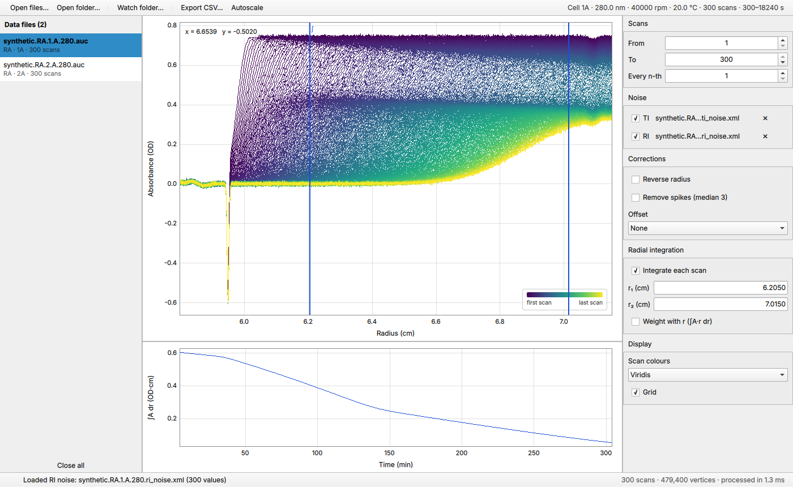

# AUCDataTool – AUC Viewer (Qt 6)

Cross-platform viewer for analytical ultracentrifugation (AUC) raw data — a C++/Qt 6
reimplementation of the LabVIEW **AUC-Viewer 2.2.2** (AG Cölfen, Universität Konstanz).

Targets Windows, macOS and Linux; the UI is Qt Quick so an Android build is possible.



## Status

| Area | State |
|---|---|
| openAUC `.auc` reader/writer (v4, v5, stddev, interpolation bitmap, CRC) | done, unit-tested (synthetic round trip; **not yet validated on real files**) |
| GPU scan plot (all scans in one pass, zoom/pan without re-upload) | done |
| Scan range / every n-th, reverse, spike filter, offset (point, baseline region) | done |
| Radial integration (∫A dr, ∫A·r dr) + integral-vs-time plot | done |
| TI/RI noise: load UltraScan noise XML or plain text, subtract per radius point / per scan | done |
| Live folder watching | done |
| CSV export | done |
| Intensity → absorbance (reference channel / reference scans) | core done, UI pending |
| MWL raw formats (`.mw`, `.mwrs` v1.0–1.4), XL `.RA/.RI/.WA/.WI/.IP`, MWA, 3D view | pending — need sample files |
| Beckman / Origin / US3 export, printing | pending |

## Build

Requirements: CMake ≥ 3.21, a C++20 compiler, Qt ≥ 6.4 (Qt 6.8 LTS recommended) with
Quick, QuickControls2 and Concurrent.

```bash
cmake -S . -B build -DCMAKE_BUILD_TYPE=Release
cmake --build build --parallel
ctest --test-dir build --output-on-failure
./build/app/AucViewer path/to/data/        # files or folders
```

Options: `-DAUC_BUILD_APP=OFF` builds only the core library, tools and tests (needs only Qt Core).

### Tools

- `aucinfo FILE.auc` — header and scan summary.
- `aucgen OUTDIR [--scans N --points N --cells N ...]` — synthetic sedimentation-velocity
  data (Faxén approximation, two species, TI/RI noise, meniscus artefact) for testing.
  Also writes the injected TI/RI noise as UltraScan noise XML.

### App command line

```
AucViewer [files/folders] [--set key=value ...] [--ti-noise FILE] [--ri-noise FILE]
          [--screenshot out.png] [--benchmark N]
```
`--set` applies processing options (e.g. `--set integrate=true --set everyNth=5`).
`--benchmark N` renders N synthetic scans and reports upload and zoom-frame times.

## Architecture

```
core/   auccore – Qt Core only, no GUI. Data model, file I/O, processing, noise, folder watcher.
app/    Qt Quick application. ScanPlot (scene-graph item), AppController, QML UI.
tools/  aucinfo, aucgen
tests/  Qt Test unit tests for the core
```

**Plot performance.** The LabVIEW viewer updated colour and data of each plot through
separate property-node calls, so drawing time grew with every scan. `ScanPlot` uploads
all scans once as coloured line segments in data coordinates (chunked at 65 534 vertices
per scene-graph node) inside its own render layer. Zoom and pan change only a transform
matrix — verified with `QSG_RENDERER_DEBUG=upload`: each buffer is uploaded exactly once,
regardless of the number of zoom frames.

**Processing** runs on a worker thread (`QtConcurrent`); option changes during a run are
coalesced, so dragging a marker never queues up stale work.

## Algorithms recovered from the LabVIEW program

Recovered from the block diagrams of AUC-Viewer 2.2.2 and implemented in
`core/src/Processing.cpp` with the same edge-case semantics:

| LabVIEW VI | Function | Definition |
|---|---|---|
| `sub_process_spectra` | `proc::absorbance` | A = −log₁₀(I/I₀) if I > 100 and I₀ > 100 counts, else 3.0 |
| `cal reference array` | `proc::meanScan` | point-wise mean of reference scans |
| `dark current subtract` | `proc::applyDarkCurrent` | ± dark-current array per point |
| `cal offset` | `proc::subtractOffsetAt` | subtract value at radius index from *Threshold 1D Array*, rounded half-to-even |
| `Dont Show Spikes` | `proc::removeSpikes` | NI Median Filter, left rank 2, right rank 0, zero-padded |
| `sub_cal_start_w2t_cal` | `proc::estimateAcceleration` | ω²t = 3.2681·10⁷(e^{7.55·10⁻⁵ v̄} − 1); t = 49.49 + 1.21·10⁻³ v̄ + 2.64357·10⁻⁸ v̄² |
| `sub_average_wl` | `proc::binWavelengths` | 1 nm bins by rounded wavelength |
| `select scans` / `cut w2t Calculation` | `proc::selectScans` | range + every n-th |

New in this version: baseline-region offset, radial integration, TI/RI noise
subtraction from files, live folder watching.

## Noise files

TI (time-invariant, one value per radius point) and RI (radially invariant, one value
per scan) noise is loaded per data file in the *Noise* panel and subtracted from the raw
scans before any other processing.

- **UltraScan III noise XML** (`<NoiseData><noise type="ti|ri" minradius=… maxradius=…><d v=…/>…`).
  A TI vector from an edited range is placed by `minradius`; the range must match the
  radius grid within half a step.
- **Plain text / CSV**: one value per line, or two columns (radius, value for TI;
  scan/time, value for RI). `#` starts a comment.

An RI vector must have exactly as many values as the file has scans. Mismatches are
reported and the noise is not applied.

## File format notes

`.auc` (openAUC, magic `UCDA`) is implemented from the published format as used by
UltraScan III: little-endian header, readings quantised to 16 bit between stored min/max,
optional stddev, interpolation bitmap (MSB first), trailing CRC-32 (zlib polynomial,
seeded with 0xFFFFFFFF). Version 4 stores the wavelength as (λ − 180)·100, version 5 as λ·10.

## Open questions

- **Radial integration**: plain ∫A dr or r-weighted (both available)?

## License

LGPL-3.0-or-later (see `LICENSE`; the LGPL incorporates the GPL-3.0 in `COPYING`).
The `.auc` format handling follows the format used by UltraScan III (LGPL-3.0).
